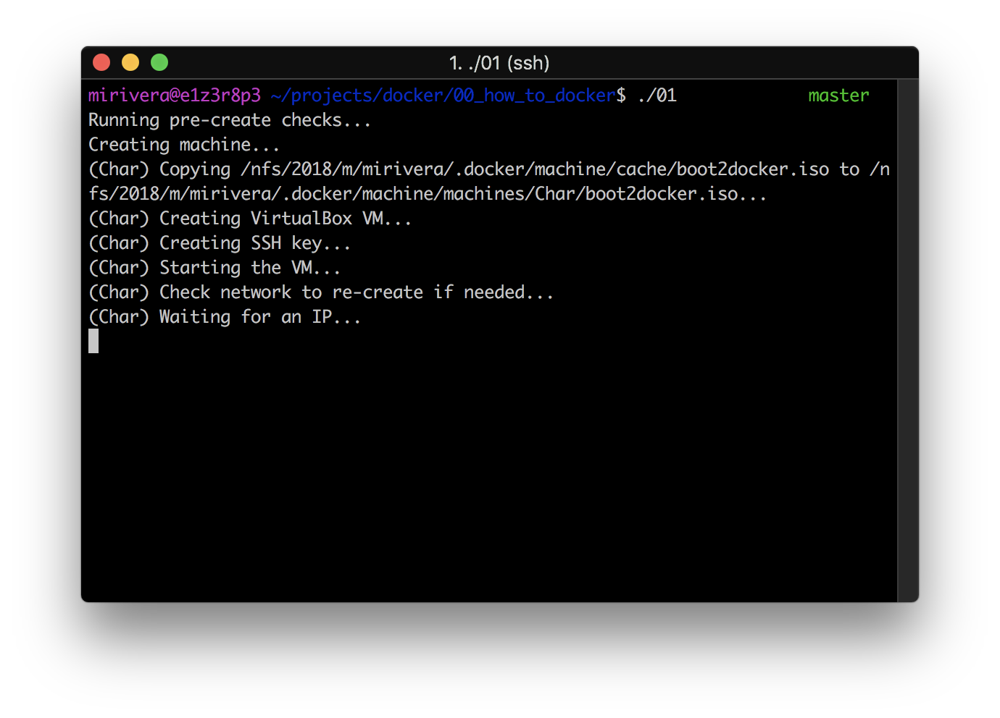

<p align="center">
  <div align="center">
   <br>
	<em><i>Spinning up containers...</i></em>
  </div>
</p>

# Docker-1

The goal for this group project is to familiarize yourself with Docker containers, Dockerfiles and Docker swarm:

I enjoyed working on this project because I was able to explore concepts that interested me during my research. The majority of my time was spent googling for the required commands and dealing with various errors that were popping up.

During this time, I tried to work with bash scripts as well, which I very much enjoyed.

**Project Document:**
[Docker-1.pdf](assets/docker.en.pdf)

## Installation

Verify that the following commands work correctly:

```docker version```
```VirtualBoxVM --help```

You should see the current Docker Engine version and other information. If not, run:

```brew update && brew install docker && brew cask install virtualbox```

## Usage

Download the repository with the following commands:

```bash
git clone https://github.com/micriver/docker_project.git
cd docker_project/00_how_to_docker
```

Once inside, cat each command and observe the output. 

The first command will spin up a Docker Virtual Machine using VirtualBox:

<p align="center">
  <div align="center">
   <br>
  </div>
</p>